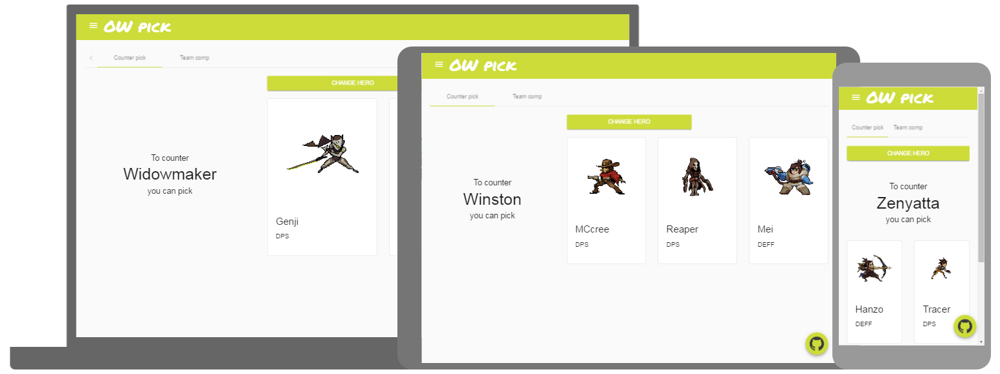

# OPH
Overwatch Pick Helper : a simple front-end app that tell you what hero you sould pick in overwatch

app is available <a target="_blank" href="https://dangeffroy.github.io/OPH/">here</a>

## Functionality

#### Counter pick
What hero you sould play to counter another hero : Done
#### Team comp
The app suggest you the hero you should play according to your team composition : Almost done, by now it suggest you a type

## Preview
<p align="center">
    
</p>

## Instalation
```bash
# Install angular-cli
npm install -g angular-cli

# install dependencies  
$ npm install 

# Start the server
$ ng serve
```

## Deploy on github-pages
```bash
# Deploy on github-pages
ng github-pages:deploy --message "optional commit message"
```

<p align="center">
    
</p>

Made with :heart: by Dan
